# TimerBetterer

A countdown timer for Pebble smartwatches, forked from Pebble's `pebble-timer` app.

## Features

- Choose your own accent color
- Configure list sorting, grouping, and wrapping
- Pause or start a timer on create
- Extra confirmation to avoid accidental deletions
- Customize snooze duration or replay timer on completion
- Touch input support
- Mix and match settings

## Preview

Pebble Time 2

| List | Timer | Settings | Accent Color |
| ---- | ----- | -------- | ------------ |
| 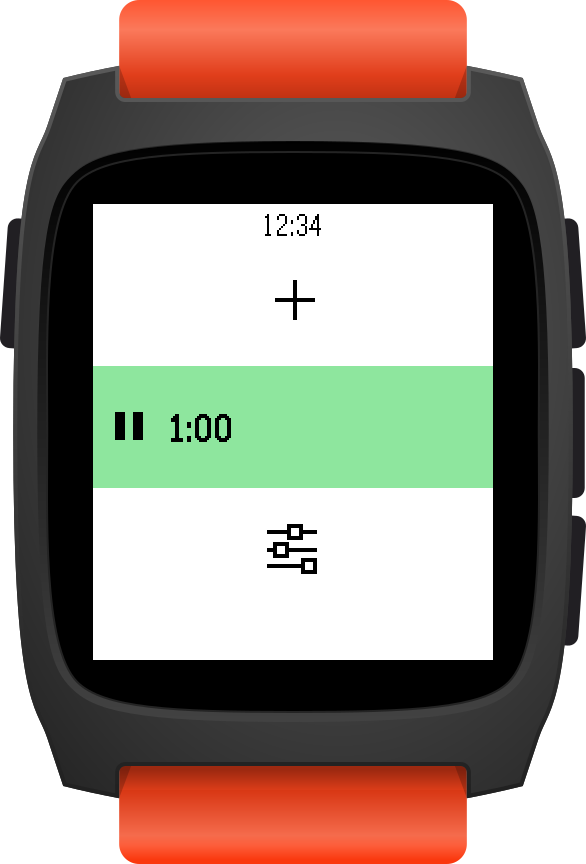 | 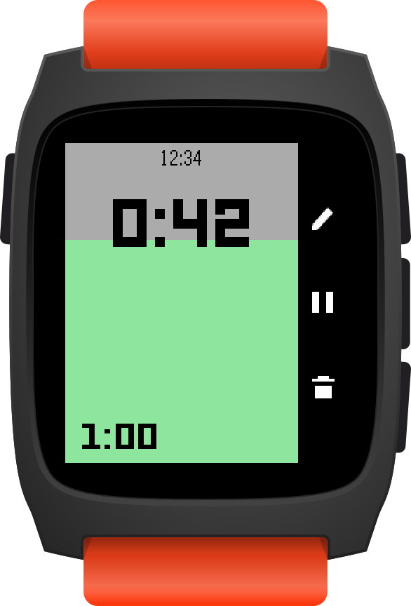 | 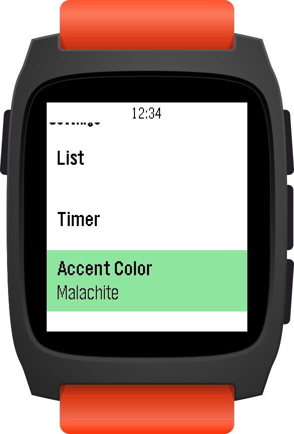 | 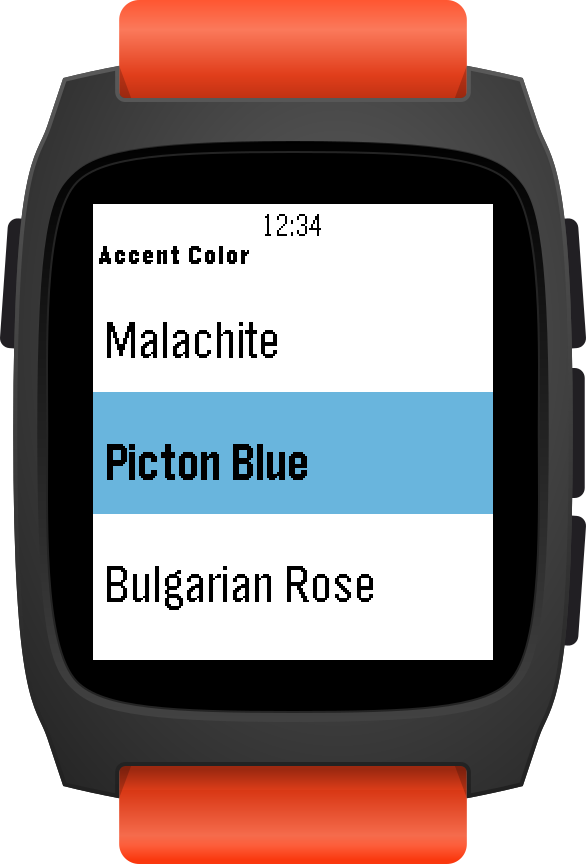 |

Pebble 2 Duo

| List | Timer | Settings | Accent Color |
| ---- | ----- | -------- | ------------ |
| 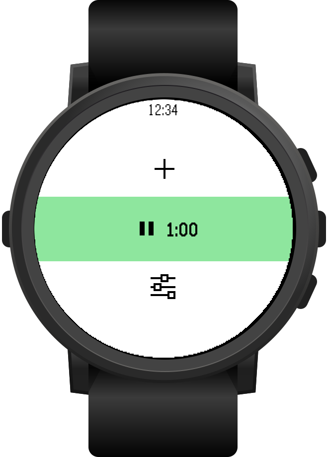 | 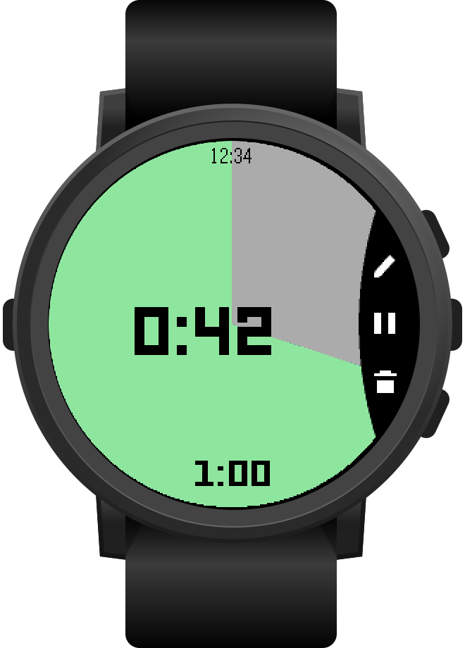 | 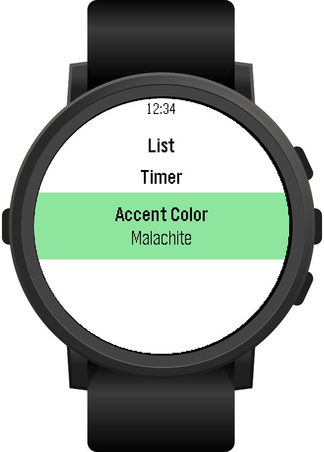 | 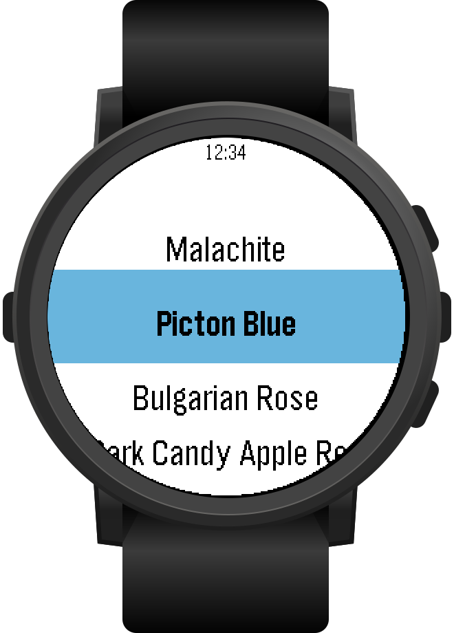 |

Pebble 2

| List | Timer | Settings |
| ---- | ----- | -------- |
| 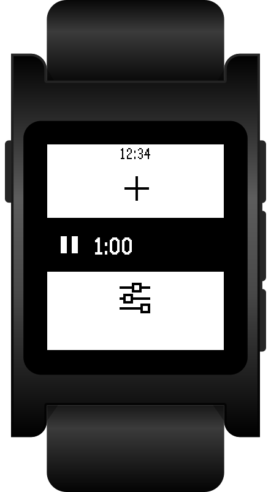 | 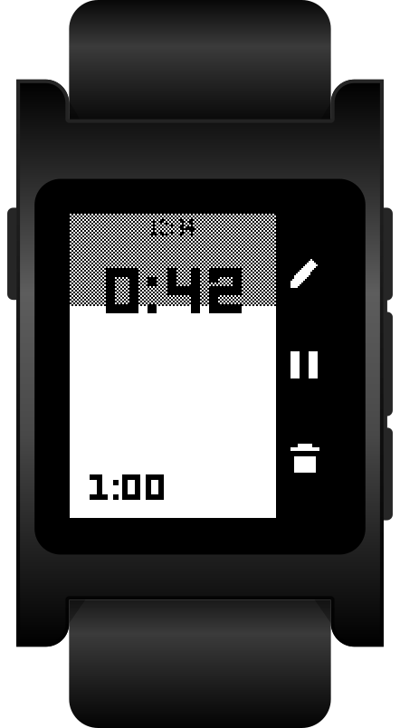 | 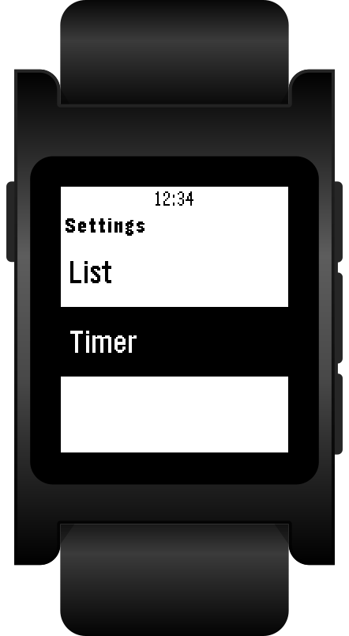 |

Pebble Time Round

| List | Timer | Settings | Accent Color |
| ---- | ----- | -------- | ------------ |
| 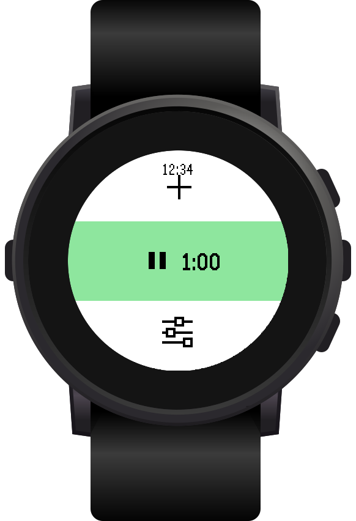 | 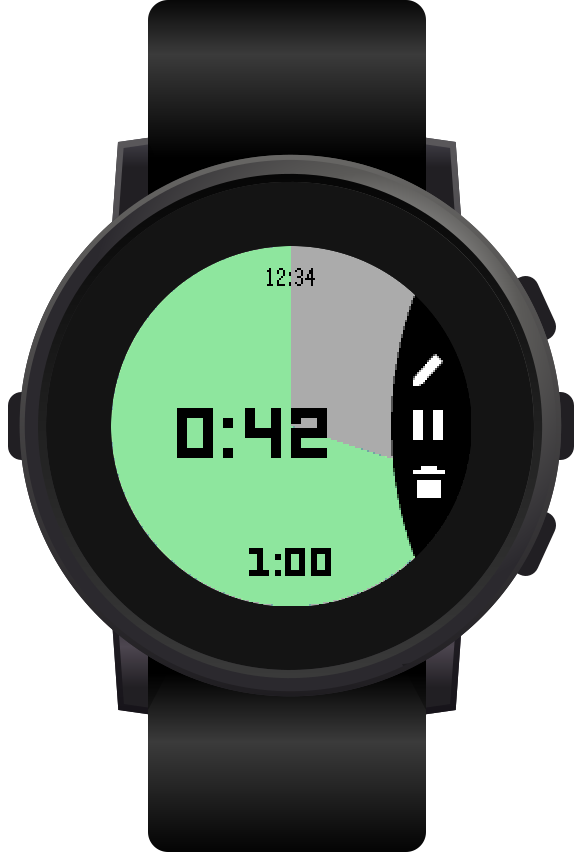 | 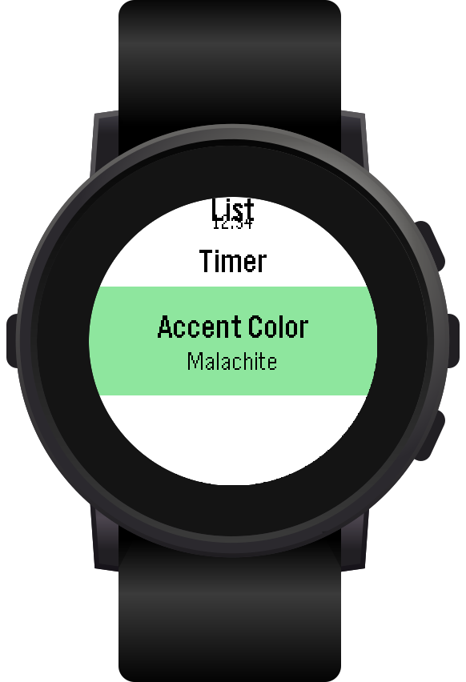 | 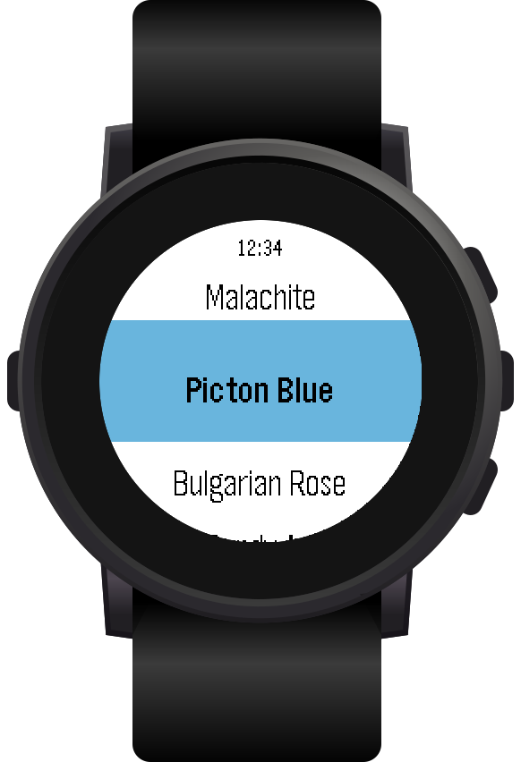 |

Pebble Time / Time Steel

| List | Timer | Settings | Accent Color |
| ---- | ----- | -------- | ------------ |
| 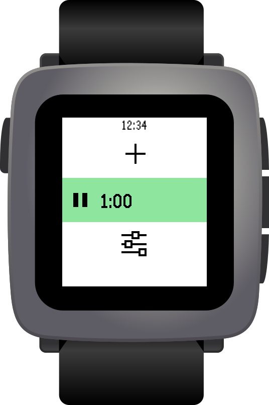 | 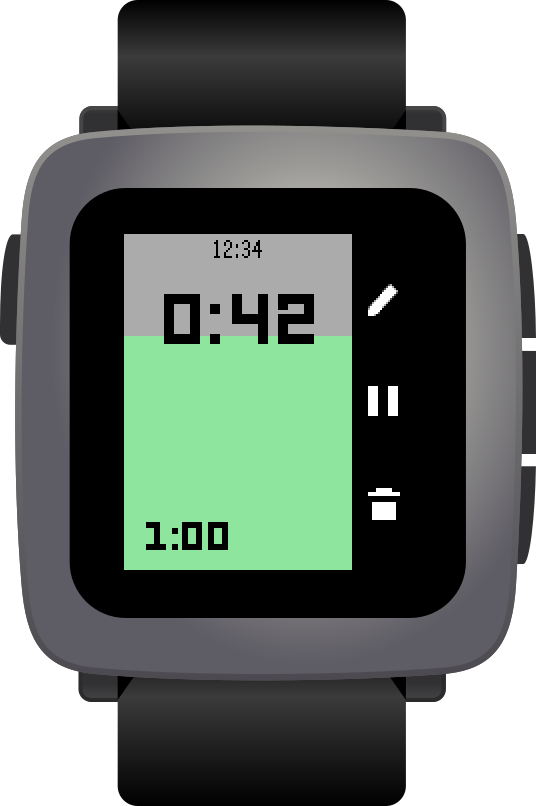 | 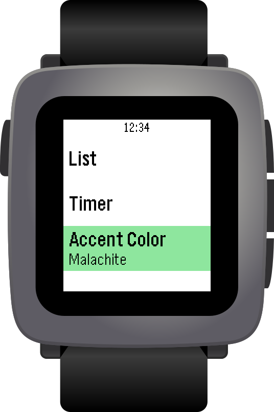 | 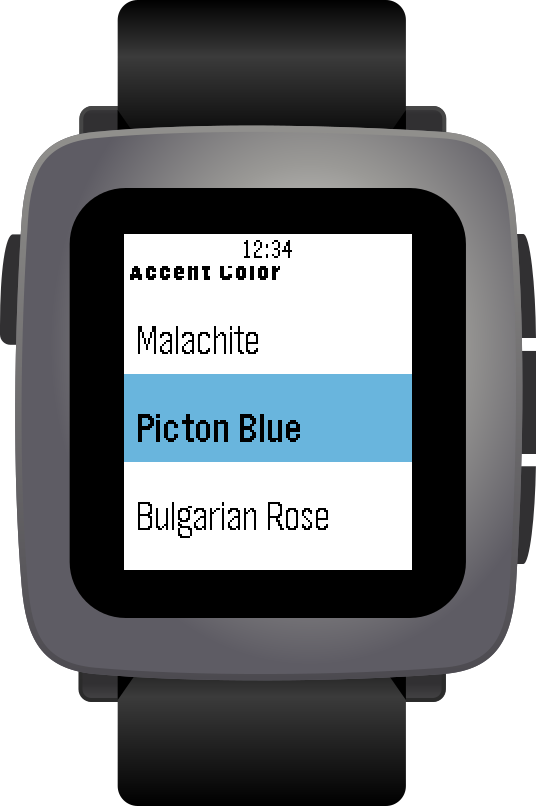 |

Pebble / Pebble Steel

| List | Timer | Settings |
| ---- | ----- | -------- |
| 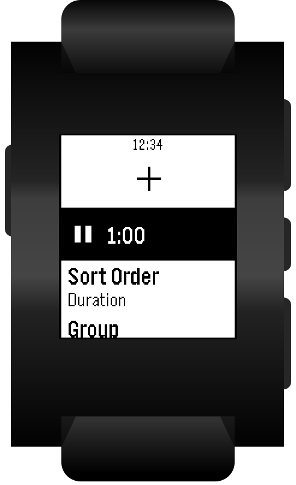 | 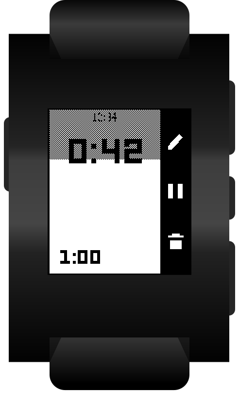 | 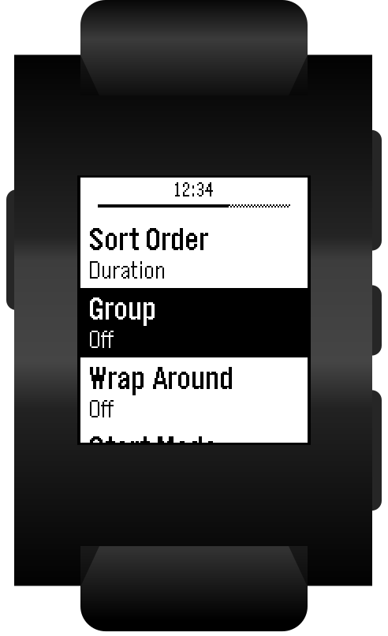 |

## Getting Started

1. Clone: `git clone https://github.com/blakegearin/timer-betterer.git`
2. Open: `cd timer-betterer`
3. Install [`uv`](https://docs.astral.sh/uv/getting-started/installation/) or [`pipx`](https://pipx.pypa.io/latest/how-to/install-pipx.html)
4. Install pebble-tool
   - uv: `uv tool install pebble-tool`
   - pipx: `pipx install pebble-tool`
5. Install SDK: `pebble sdk install latest`

## Running

### On Real Hardware

1. Open the Pebble app
2. Navigate to the Devices tab
3. Select the kebab icon to open the device menu
4. Enable toggle for "Dev Connection"
5. Build: `make build`
6. Install: `make sideload`

### Emulator

- Start: `make run PLAT=<platform>`

  - Pebble / Pebble Steel: `aplite`
  - Pebble Time / Pebble Time Steel: `basalt`
  - Pebble Time Round: `chalk`
  - Pebble 2: `diorite`
  - Pebble Time 2: `emery`
  - Pebble 2 Duo: `gabbro`

- Stop: `make kill`

Control the emulator with a keyboard or mouse.

- Up button: `Up`
- Down button: `Down`
- Select button: `Enter`
- Back button: `Delete` / `Backspace`
- Tapping: mouse
  - Only on touch-capable platforms: `chalk`, `emery`, `gabbro`

## Credits

- Fork of [coredevices/pebble-timer](https://github.com/coredevices/pebble-timer), originally by Eric Phillips for Pebble
- Icons from [pebble-dev/iconography](https://github.com/pebble-dev/iconography)
- Device renders from [developer.repebble.com](https://developer.repebble.com)
